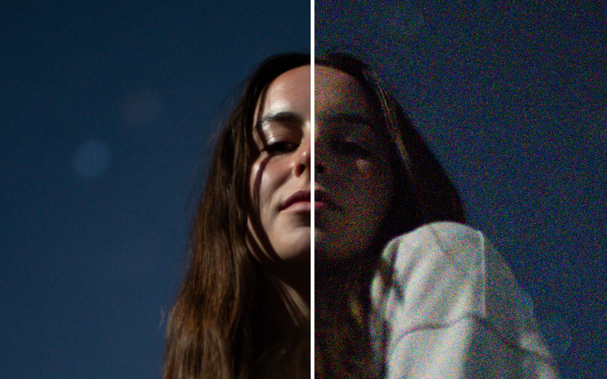
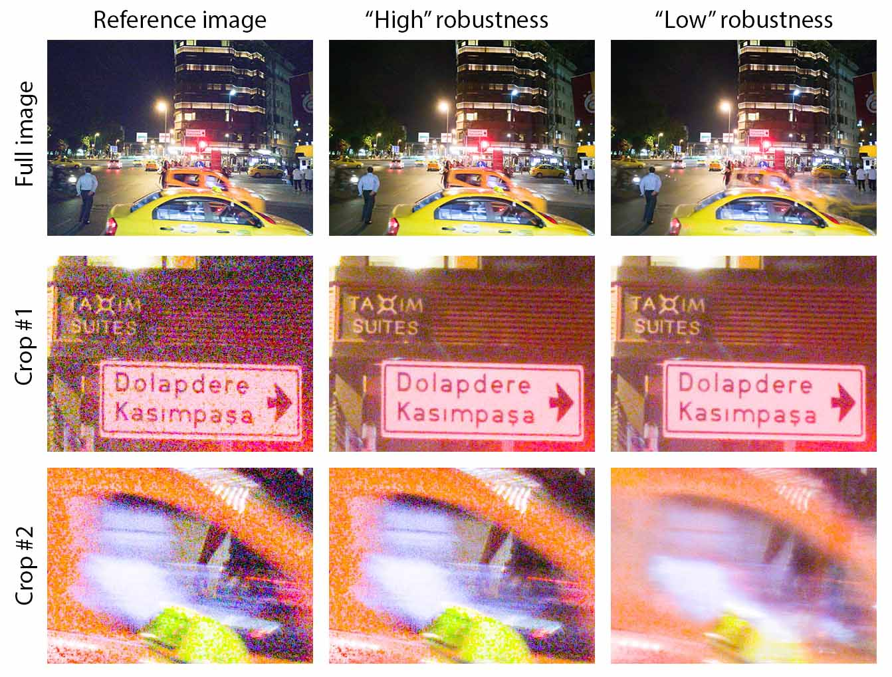
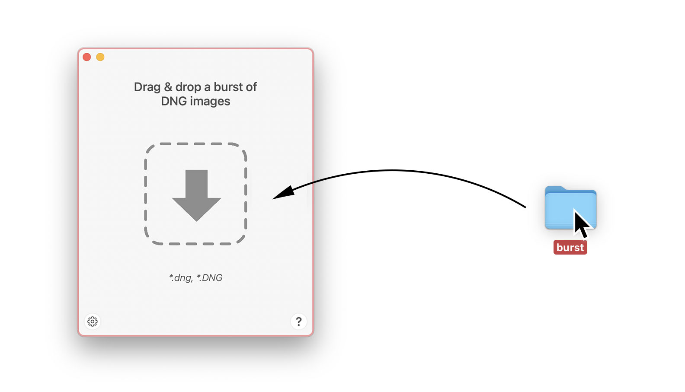

# Burst Photo

This is a macOS app written in Swift / SwiftUI / Metal that implements a simplified version of HDR+, the computational photography pipeline in Google Pixel phones. You can read more about HDR+ in Google's paper [Burst photography for high dynamic range and low-light imaging on mobile cameras](http://static.googleusercontent.com/media/www.hdrplusdata.org/en//hdrplus.pdf).

If you are a researcher or you prefer Python/PyTorch, you can check out [hdr-plus-pytorch](https://github.com/martin-marek/hdr-plus-pytorch).

# Example

In the example, a burst of 51 images was taken at ISO 51,200 on a Sony A7S III camera. Exposure was adjusted to taste with equal settings for both images. Here is a [comparison](docs/assets/images/gallery/monika_stars.jpg) of a single image from the burst versus a merge of all the images.

To test motion-robustness, a burst with strong scene motion is evaluated. Here is a [full comparison](docs/assets/images/gallery/robustness_comparison.jpg) of results. The figure is similar to Figure 6 in Google's original [publication](http://static.googleusercontent.com/media/www.hdrplusdata.org/en//hdrplus.pdf). The input image was taken from Google's [HDR+ dataset](https://hdrplusdata.org/dataset.html) licensed under [CC BY-SA](https://creativecommons.org/licenses/by-sa/4.0/).

For more examples, please visit [burst.photo/gallery/](https://burst.photo/gallery/).

# Usage

To process a burst of RAW images, simply drag-and-drop them into the app. Only DNG files are supported by default - but if you download and install [Adobe DNG Converter](https://helpx.adobe.com/camera-raw/using/adobe-dng-converter.html), Burst Photo will be able to convert most RAW formats in the background. You can read more at [burst.photo/help/](https://burst.photo/help/).

# Download

You can download the app from the [Mac App Store](https://burst.photo/download/) or as a [GitHub release](https://github.com/martin-marek/hdr-plus-swift/releases).

# Features
- [x] DNG support
- [x] RAW support (requires Adobe DNG Converter to be installed)
- [x] simple temporal averaging
- [x] robust merge in spatial domain (simplified)
- [x] robust merge in frequency domain (similar to original publication)
- [x] Bayer sensor support (good)
- [x] non-Bayer sensor support (beta)
- [x] support for bursts with bracketed exposure
- [x] optional exposure correction to improve tonality in the shadows
- [x] optional output with full 16 bit precision
- [x] preserves lens profiles
- [x] hot pixel suppression
- [x] multi-threaded image loading
- [x] align+merge running in pure Metal
- [x] native Intel, Apple Silicon support

# List of Ideas
- [ ] add super-resolution algorithm
- [ ] fix progressbar getting stuck loading the first image

Please feel free to contribute to any of these features or suggest other features.

# Acknowledgements

This product includes DNG technology under license by Adobe.
