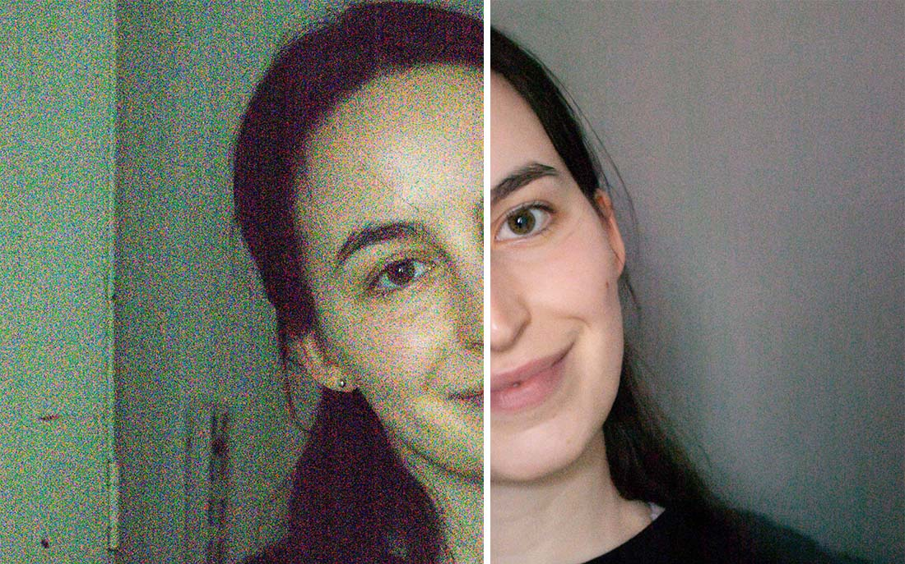

# Burst Photo

This is a simplified Swift/Metal implementation of HDR+, the backbone of computational photography in Google Pixel phones, described in [Burst photography for high dynamic range and low-light imaging on mobile cameras](http://static.googleusercontent.com/media/www.hdrplusdata.org/en//hdrplus.pdf).

[](https://burst.photo/download/)
 
# Example

I took a burst of 35 images at ISO 12,800 on Sony RX100-V and boosted it by +2EV. Here's a comparison of a single image from the burst vs. a merge of all the images.



To test motion-robustness, I compared a raw image, output from the app using `Robustness` set to `High`, and output from the app using `Robustness` set to `Low`. You can compare my results to Google's by opening Figure 6 in their [paper](http://static.googleusercontent.com/media/www.hdrplusdata.org/en//hdrplus.pdf). Image taken from Google's [HDR+ dataset](https://hdrplusdata.org/dataset.html) licensed under [CC BY-SA](https://creativecommons.org/licenses/by-sa/4.0/).


For more examples, please visit [burst.photo/gallery/](https://burst.photo/gallery/).

# Usage

To process a burst of DNG images, simply drag-and-drop them into the app. You can read more at [burst.photo/help/](https://burst.photo/help/).


# Features
- [x] DNG support
- [x] robust merge
- [x] mutli-threaded image loading
- [x] align+merge running in pure Metal

# TODO
- [ ] Fix progressbar getting stuck loading the first image
- [ ] ARM support – requires recompiling Adobe DNG SDK
- [ ] 32-bit output - how can this be achieved in Adobe DNG SDK?
- [ ] super-resolution

Please feel free to contribute to any of these features or suggest other features.

# Acknowledgements

This product includes DNG technology under license by Adobe.

# Citation

```bibtex
@article{hasinoff2016burst,
  title={Burst photography for high dynamic range and low-light imaging on mobile cameras},
  author={Hasinoff, Samuel W and Sharlet, Dillon and Geiss, Ryan and Adams, Andrew and Barron, Jonathan T and Kainz, Florian and Chen, Jiawen and Levoy, Marc},
  journal={ACM Transactions on Graphics (ToG)},
  volume={35},
  number={6},
  pages={1--12},
  year={2016},
  publisher={ACM New York, NY, USA}
}
```